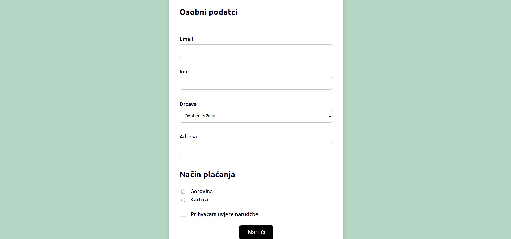

In March 2023 I attended a 2-month long React education at [Digitalna Dalmacija](https://digitalnadalmacija.hr/). The education lasted for 8 weeks, and every week I was required to build a new project. This is the projects I build in the 3rd week.

## Table of contents

- [Screenshot](#screenshot)
- [Links](#links)
- [Built with](#built-with)
- [What I learned](#what-i-learned)

### Screenshot

### Links

- Live Site URL: https://jure-reljanovic-juniordev-w3.netlify.app/

### Built with

- [React](https://reactjs.org/)

### What I learned

The third week was quite easy. I learned a little bit more about how to handle different inputs and about an important concept called "Lifting the state up". That allowed me to be able to send data from child to parent components.
